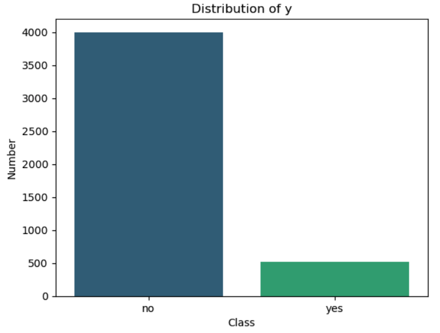
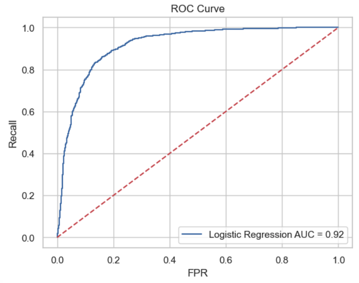
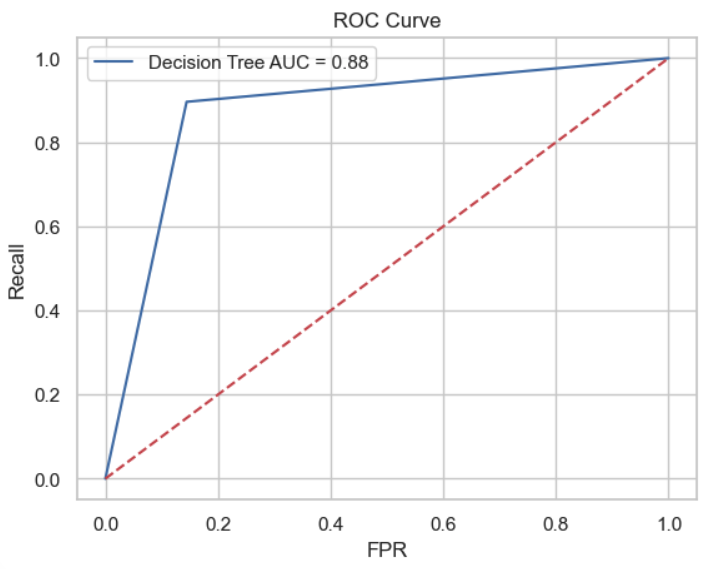
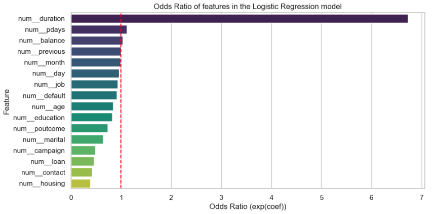
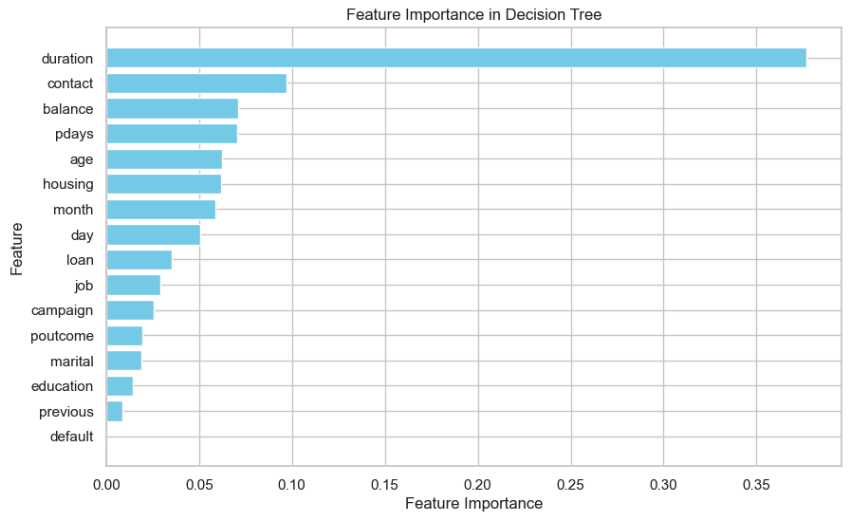

# Predicting Bank Customer Subscription

## Project Overview

### Project Objective
The objective of this project is to build two predictive models — **Logistic Regression** and **Decision Tree** — to predict whether a bank customer will subscribe to a term deposit.

### Business Context
Banks frequently conduct marketing campaigns to encourage customers to subscribe to term deposits. Understanding which factors — especially demographics and campaign-specific attributes — influence customer decisions can help optimize marketing efforts, reduce costs, and improve conversion rates.

---

## Dataset Structure

The dataset contains **4521 observations** and **16 features** (7 numerical, 9 categorical), plus one target variable (`y`).

### Main Features

- `age` (numeric)
- `job` (categorical): type of job
- `marital` (categorical): marital status
- `education` (categorical): education level
- `default` (binary): has credit in default?
- `balance` (numeric): average yearly balance in euros
- `housing` (binary): has a housing loan?
- `loan` (binary): has a personal loan?
- `contact` (categorical): contact communication type
- `day` (numeric): last contact day of the month
- `month` (categorical): last contact month of the year
- `duration` (numeric): duration of last contact in seconds
- `campaign` (numeric): number of contacts during the campaign
- `pdays` (numeric): days since last contact in previous campaign
- `previous` (numeric): number of prior contacts
- `poutcome` (categorical): result of previous campaign

### Target Variable

- `y` (binary): Has the client subscribed a term deposit? (`yes` or `no`)

> **Note:** The dataset is highly imbalanced. SMOTE (Synthetic Minority Over-sampling Technique) was applied to handle this issue and significantly improved model performance.

---
## Model Predictive Power

### Logistic Regression

- Precision (Yes) = 0.83
- Recall (Yes) = 0.87
- F1-Score (Yes) = 0.85
- Accuracy = 0.85

- AUC = 0.92

### Decision Tree

- Precision (Yes) = 0.86
- Recall (Yes) = 0.90
- F1-Score (Yes) = 0.88
- Accuracy = 0.88

- AUC = 0.88

## Insights Summary

### Key Metrics

- **Duration** of last contact is by far the most influential predictor in both models.
- **Pdays** (recency of previous contact) also strongly influences subscription likelihood.
- **Previous contact outcome (poutcome)** and **balance** show moderate influence.

### Logistic Regression Insights

- A unit increase in **duration** increases the odds of subscribing by more than 6 times.
- Clients who were contacted previously (**pdays**) are more likely to subscribe.
- Demographic factors (e.g., **age**, **job**) have moderate effects.
- Features like **contact day** and **month** show some timing sensitivity.

### Decision Tree Insights

- Confirms **duration** as the dominant factor.
- Emphasizes interactions between campaign-related features such as **campaign**, **pdays**, and **balance**.
- Identifies splitting patterns based on previous outcomes and contact method.

---

## Recommendations

### Focus on Duration

- Train call center employees to **engage longer and more effectively** during client conversations — longer, high-quality calls significantly boost subscription rates.

### Optimize Contact Timing

- Prioritize clients who were **previously contacted** (`pdays ≠ -1`), as their likelihood to subscribe is notably higher.
- Analyze **best-performing months and days** from past campaigns and schedule future campaigns accordingly.

### Segment Based on Past Outcomes

- Use historical campaign data (`poutcome`) to build **targeted re-engagement strategies** for clients who previously responded positively.

### Balance Demographic Targeting with Behavior-Based Insights

- While demographic variables play a secondary role, combining them with behavioral factors (duration, pdays, previous) can help create **more accurate customer personas** for targeting.

### Technical Notes

- For imbalanced datasets, **SMOTE** or other resampling techniques are highly recommended to improve model generalization and fairness across classes.

---

## Next Steps

- Explore ensemble models (e.g., Random Forest, Gradient Boosting) to further improve accuracy.
- Add cost-sensitive evaluation to better handle class imbalance in business terms.
- Integrate results into a live dashboard for marketing teams to access real-time recommendations.

